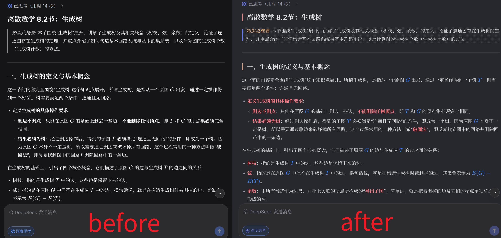

# DeepSeek-Refined

一个 Tampermonkey 用户脚本，为网页版 DeepSeek Chat (chat.deepseek.com) 注入 Obsidian Border 主题风格的 Markdown 美化样式。通过覆盖 DeepSeek 的 CSS 变量系统，实现深色/浅色模式的全面配色定制。支持粗体、斜体、行内代码、数学公式的颜色自定义；各级标题左侧添加彩色圆角竖条装饰；引用块使用 Border 标志性的点阵图案背景。同时调整消息宽度为 75% 以获得更好的阅读体验。安装后自动跟随系统深浅色模式切换，无需手动配置。配色灵感来源于 Obsidian Border 主题。




## 功能特性

### 全局配色

- 深色模式背景:  `#27282e`
- 浅色模式背景:  `#ffffff`
- 文字颜色采用 Border 主题的柔和灰度配色
- 支持深色/浅色模式自动切换

### Markdown 元素美化

| 元素          | 深色模式                                                              | 浅色模式                                                                                      |
| ----------- | --------------------------------------------------------------------- | --------------------------------------------------------------------------------------------- |
| 粗体 (bold)   |  `#ff7881`   |  `hsl(350, 80%, 55%)`        |
| 斜体 (italic) |  `#fbbb83`   |  `hsl(28, 80%, 50%)`          |
| 行内代码        |  `#f2b6de`   |  `#dd1399`                            |
| 数学公式        |  `#3b82f6`   |  `#3b82f6`                            |

### 标题样式

各级标题左侧带有彩色圆角竖条:

| 级别 | 深色模式                                                          | 浅色模式                                                          |
| -- | ----------------------------------------------------------------- | ----------------------------------------------------------------- |
| H1 |  `#d18989` |  `#bd5151` |
| H2 |  `#cea38d` |  `#c77b23` |
| H3 |  `#93c89c` |  `#478f14` |
| H4 |  `#7eb8f1` |  `#0585a8` |
| H5 |  `#bab3ef` |  `#726293` |
| H6 |  `#7ec8c5` |  `#127d52` |

### 引用块样式

- 移除默认左侧边框
- 添加 Border 风格的点阵图案背景
- 使用 `::before` 伪元素实现圆角竖条装饰
- 嵌套引用不重复显示点阵图案

### 布局调整

- 消息最大宽度: `75%`
- 表格最大宽度: `70%`

## 安装方法

1. 安装 [Tampermonkey](https://www.tampermonkey.net/) 浏览器扩展
2. 点击 Tampermonkey 图标 -> 添加新脚本
3. 复制 `main.js` 的全部内容
4. 粘贴到编辑器中，保存
5. 访问 <https://chat.deepseek.com/> 即可生效

## 自定义修改

### 修改深色模式背景色

```css
body[data-ds-dark-theme] {
    --dsw-alias-bg-base: #你的颜色;
}
